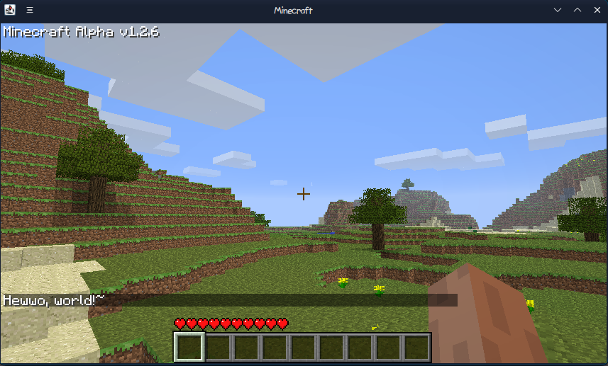

# 🔧 Example QuartzAPI mod

This is a example mod for QuartzAPI. It displays `Mod started successfully` in game logs on game launch.

After starting in world you should saw `Hewwo, world!~` sentence on chat.

This is a simple example, not showing much features. Actually, it's rather showing body of Quartz mods. I will update this example when I make some progress on Quartz developing. More examples coming soon too.

## 🌸 Showcase

Not much rn, but it's works and shows `Hewwo, world!~` on chat. Yippie.

